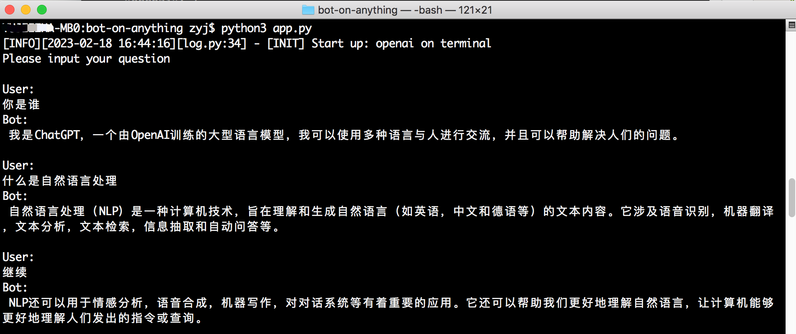
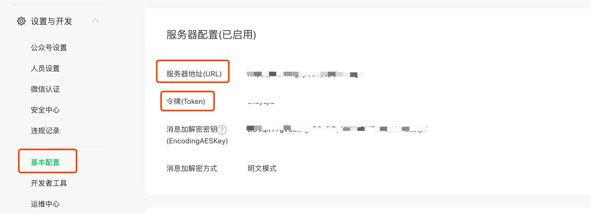

# 简介

将 **AI模型** 接入各类 **消息应用**，开发者通过轻量配置即可在二者之间选择一条连线，运行起一个智能对话机器人，在一个项目中轻松完成多条链路的切换。该架构扩展性强，每接入一个应用可复用已有的算法能力，同样每接入一个模型也可作用于所有应用之上。

**模型：**

 - [x] [ChatGPT (gpt-3.5)](https://github.com/zhayujie/bot-on-anything#1-chatgpt)
 - [x] [GPT-3.0](https://github.com/zhayujie/bot-on-anything#2gpt-30)
 - [x] 文心一言 (测试版)
 - [x] [New Bing](https://github.com/zhayujie/bot-on-anything#4newbing)

 
**应用：**

 - [x] [终端](https://github.com/zhayujie/bot-on-anything#1%E5%91%BD%E4%BB%A4%E8%A1%8C%E7%BB%88%E7%AB%AF)
 - [x] [Web](https://github.com/zhayujie/bot-on-anything#9web)
 - [x] [个人微信](https://github.com/zhayujie/bot-on-anything#2%E4%B8%AA%E4%BA%BA%E5%BE%AE%E4%BF%A1)
 - [x] [订阅号](https://github.com/zhayujie/bot-on-anything#3%E4%B8%AA%E4%BA%BA%E8%AE%A2%E9%98%85%E5%8F%B7)
 - [x] [服务号](https://github.com/zhayujie/bot-on-anything#4%E4%BC%81%E4%B8%9A%E6%9C%8D%E5%8A%A1%E5%8F%B7)
 - [ ] 企业微信
 - [x] [Telegram](https://github.com/zhayujie/bot-on-anything#6telegram)
 - [x] [QQ](https://github.com/zhayujie/bot-on-anything#5qq)
 - [ ] 钉钉 
 - [ ] 飞书
 - [x] [Gmail](https://github.com/zhayujie/bot-on-anything#7gmail)
 - [x] [Slack](https://github.com/zhayujie/bot-on-anything#8slack)

# 快速开始

## 一、准备

### 1.运行环境

支持 Linux、MacOS、Windows 系统（Linux服务器上可长期运行)。同时需安装 Python，建议Python版本在 3.7.1~3.10 之间。

项目代码克隆：

```bash
git clone https://github.com/zhayujie/bot-on-anything
cd bot-on-anything/
```
> 或在 Realase 直接手动下载源码。

### 2.配置说明

核心配置文件为 `config.json`，在项目中提供了模板文件 `config-template.json` ，可以从模板复制生成最终生效的 `config.json` 文件：

```bash
cp config-template.json config.json
```

每一个模型和应用都有自己的配置块，最终组成完整的配置文件，整体结构如下：

```bash
{
  "model": {
    "type" : "chatgpt",             # 选用的算法模型
    "openai": {
      # openAI配置
    }
  },
  "channel": {
    "type": "wechat_mp",            # 需要接入的应用 
    "wechat": {
        # 个人微信配置
    },
    "wechat_mp": {
        # 公众号配置
    }
  }
}
```
配置文件在最外层分成 `model` 和 `channel` 两部分，model部分为模型配置，其中的 `type` 指定了选用哪个模型；channel部分包含了应用渠道的配置，`type` 字段指定了接入哪个应用。

在使用时只需要更改 model 和 channel 配置块下的 type 字段，即可在任意模型和应用间完成切换，连接不同的通路。下面将依次介绍各个 模型 及 应用 的配置和运行过程。


## 二、选择模型

### 1. ChatGPT

使用的模型是 `gpt-3.5-turbo`，详情参考[官方文档](https://platform.openai.com/docs/guides/chat)。

#### (1) 注册 OpenAI 账号

前往 [OpenAI注册页面](https://beta.openai.com/signup) 创建账号，参考这篇 [教程](https://www.cnblogs.com/damugua/p/16969508.html) 可以通过虚拟手机号来接收验证码。创建完账号则前往 [API管理页面](https://beta.openai.com/account/api-keys) 创建一个 API Key 并保存下来，后面需要在项目中配置这个key。

> 项目中使用的对话模型是 davinci，计费方式是约每 750 字 (包含请求和回复) 消耗 $0.02，图片生成是每张消耗 $0.016，账号创建有免费的 $18 额度，使用完可以更换邮箱重新注册。

#### (2) 安装依赖

```bash
pip3 install --upgrade openai
```
> 注： openai版本需要`0.27.0`以上。如果安装失败可先升级pip，`pip3 install --upgrade pip`


#### (3) 配置项说明

```bash
{
  "model": {
    "type" : "chatgpt",
   
    "openai": {
      "api_key": "YOUR API KEY",
      "model": "gpt-3.5-turbo",                         # 模型名称
      "proxy": "http://127.0.0.1:7890",
      "character_desc": "你是ChatGPT, 一个由OpenAI训练的大型语言模型, 你旨在回答并解决人们的任何问题，并且可以使用多种语言与人交流。"
    }
}
```
 + `api_key`: 填入上面注册账号时创建的 `OpenAI API KEY`
 + `model`: 模型名称，目前支持填入 `gpt-3.5-turbo`, `gpt-4`, `gpt-4-32k`  (其中gpt-4 api暂未开放)
 + `proxy`: 代理客户端的地址，详情参考  [#56](https://github.com/zhayujie/bot-on-anything/issues/56)
 + `character_desc`: 配置中保存着你对chatgpt说的一段话，他会记住这段话并作为他的设定，你可以为他定制任何人格

### 2.GPT-3.0

使用的模型是 `text-davinci-003`，详情参考[官方文档]([https://platform.openai.com/docs/guides/chat](https://platform.openai.com/docs/guides/completion/introduction))。

使用步骤和上述GPT-3.5基本相同：

1. 注册OpenAI账号并配置API KEY
2. 安装openai依赖，要求版本高于 `0.25.0` 
3. 修改`config.json`配置中的type字段为 `openai`
 
```bash
{
  "model": {
    "type" : "openai",
   
    "openai": {
      "api_key": "YOUR API KEY",
      "character_desc": "你是ChatGPT, 一个由OpenAI训练的大型语言模型, 你旨在回答并解决人们的任何问题，并且可以使用多种语言与人交流。"
    }
}
```

### 3.文心一言 (测试版)

参考: [#154](https://github.com/zhayujie/bot-on-anything/issues/154)


### 4.NewBing

使用的是https://github.com/acheong08/EdgeGPT 网页版逆向API

#### (1) 安装依赖

```bash
pip3 install EdgeGPT --upgrade
```

#### (2) 配置项说明

```bash
{
  "model": {
    "type" : "bing",
    "bing": {
      "cookies":[]  //edge登录https://www.bing.com/new 获取的json格式name为"_U"的cookies，目前看cookies有效期应该为14天
    }
}
cookie示例:
"cookies":[
    {
        "domain": ".bing.com",
        "expirationDate": 1680372573.67057,
        "hostOnly": false,
        "httpOnly": false,
        "name": "_U",
        "path": "/",
        "sameSite": "no_restriction",
        "secure": true,
        "session": false,
        "storeId": null,
        "value": ""
    }
]
```

## 三、选择应用

### 1.命令行终端

配置模板中默认启动的应用即是终端，无需任何额外配置，直接在项目目录下通过命令行执行 `python3 app.py` 便可启动程序。用户通过命令行的输入与对话模型交互，且支持流式响应效果。




### 2.个人微信

与项目 [chatgpt-on-wechat](https://github.com/zhayujie/chatgpt-on-wechat) 的使用方式相似。

**安装依赖：**

```bash
pip3 install itchat-uos==1.5.0.dev0
pip3 install --upgrade openai
```
注：`itchat-uos`使用指定版本1.5.0.dev0，`openai`使用最新版本，需高于0.27.0。


**配置项说明：**

```bash
"channel": {
    "type": "wechat",
    
    "single_chat_prefix": ["bot", "@bot"],
    "single_chat_reply_prefix": "[bot] ",
    "group_chat_prefix": ["@bot"],
    "group_name_white_list": ["ChatGPT测试群"],
    "image_create_prefix": ["画", "看", "找一张"],
    
    "wechat": {
    }
}
```
个人微信的配置项放在和 `type` 同级的层次，表示这些为公共配置，会复用于其他应用。配置加载时会优先使用模块内的配置，如果未找到便使用公共配置。

在项目根目录下执行 `python3 app.py` 即可启动程序，用手机扫码后完成登录，使用详情参考 [chatgpt-on-wechat](https://github.com/zhayujie/chatgpt-on-wechat)。


### 3.个人订阅号

**需要：** 一台服务器，一个订阅号

#### 3.1 依赖安装

安装 [werobot](https://github.com/offu/WeRoBot) 依赖：

```bash
pip3 install werobot
```

#### 3.2 配置

```bash
"channel": {
    "type": "wechat_mp",
        
    "wechat_mp": {
      "token": "YOUR TOKEN",           # token值
      "port": "8088"                   # 程序启动监听的端口
    }
}
```

#### 3.3 运行程序

在项目目录下运行 `python3 app.py`，终端显示如下则表示已成功运行：

```
[INFO][2023-02-16 01:39:53][app.py:12] - [INIT] load config: ...
[INFO][2023-02-16 01:39:53][wechat_mp_channel.py:25] - [WX_Public] Wechat Public account service start!
Bottle v0.12.23 server starting up (using AutoServer())...
Listening on http://127.0.0.1:8088/
Hit Ctrl-C to quit.
```

#### 2.2 设置公众号回调地址

在 [微信公众平台](https://mp.weixin.qq.com/) 中进入个人订阅号，启用服务器配置：



**服务器地址 (URL) 配置**： 如果在浏览器上通过配置的URL 能够访问到服务器上的Python程序 (默认监听8088端口)，则说明配置有效。由于公众号只能配置 80/443端口，可以修改配置为直接监听 80 端口 (需要sudo权限)，或者使用反向代理进行转发 (如nginx)。 根据官方文档说明，此处填写公网ip或域名均可。

**令牌 (Token) 配置**：需和 `config.json` 配置中的token一致。

详细操作过程参考 [官方文档](https://developers.weixin.qq.com/doc/offiaccount/Getting_Started/Getting_Started_Guide.html)


#### 2.3 使用

用户关注订阅号后，发送消息即可。

> 注：用户发送消息后，微信后台会向配置的URL地址推送，但如果5s内未回复就会断开连接，同时重试3次，但往往请求openai接口不止5s。本项目中通过异步和缓存将5s超时限制优化至15s，但超出该时间仍无法正常回复。 同时每次5s连接断开时web框架会报错，待后续优化。


### 4.企业服务号

**需要：** 一个服务器、一个已微信认证的服务号

在企业服务号中，通过先异步访问openai接口，再通过客服接口主动推送给用户的方式，解决了个人订阅号的15s超时问题。服务号的开发者模式配置和上述订阅号类似，详情参考 [官方文档](https://developers.weixin.qq.com/doc/offiaccount/Getting_Started/Getting_Started_Guide.html)。

企业服务号的 `config.json` 配置只需修改type为`wechat_mp_service`，但配置块仍复用 `wechat_mp`，在此基础上需要增加 `app_id` 和 `app_secret` 两个配置项。

```bash
"channel": {
    "type": "wechat_mp_service",
        
    "wechat_mp": {
      "token": "YOUR TOKEN",            # token值
      "port": "8088",                   # 程序启动监听的端口
      "app_id": "YOUR APP ID",          # app ID
      "app_secret": "YOUR APP SECRET"   # app secret
    }
}
```

注意：需将服务器ip地址配置在 "IP白名单" 内，否则用户将收不到主动推送的消息。

### 5.QQ

需要：一台PC或服务器 (国内网络)、一个QQ号

运行qq机器人 需要额外运行一个`go-cqhttp` 程序，cqhttp程序负责接收和发送qq消息， 我们的`bot-on-anything`程序负责访问`openai`生成对话内容。

#### 5.1 下载 go-cqhttp

在 [go-cqhttp的Release](https://github.com/Mrs4s/go-cqhttp/releases) 中下载对应机器的程序，解压后将 `go-cqhttp` 二进制文件放置在我们的 `bot-on-anything/channel/qq` 目录下。 同时这里已经准备好了一个 `config.yml` 配置文件，仅需要填写其中的 QQ 账号配置 (account-uin)。

#### 5.2 安装 aiocqhttp

使用 [aiocqhttp](https://github.com/nonebot/aiocqhttp) 来与 go-cqhttp 交互， 执行以下语句安装依赖：

```bash
pip3 install aiocqhttp
```

#### 5.3 配置

只需修改 `config.json` 配置文件 channel 块中的 type 为 `qq`：

```bash
"channel": {
    "type": "qq"
}
```

#### 5.4 运行

首先进入 `bot-on-anything` 项目根目录，在 终端1 运行：

```bash
python3 app.py    # 此时会监听8080端口
```

第二步打开 终端2，进入到放置 `cqhttp` 的目录并运行：

```bash
cd channel/qq
./go-cqhttp
```
注意：
+ 目前未设置任何 关键词匹配 及 群聊白名单，对所有私聊均会自动回复，在群聊中只要被@也会自动回复。
+ 如果出现 账号被冻结 等异常提示，可将 go-cqhttp 同目录下的 device.json 文件中`protocol`的值由5改为2，参考该[Issue](https://github.com/Mrs4s/go-cqhttp/issues/1942)。


### 6.Telegram

Contributor: [brucelt1993](https://github.com/brucelt1993)

**6.1 获取token**

telegram 机器人申请可以自行谷歌下，很简单，重要的是获取机器人的token id。


**6.2 依赖安装**

pip install pyTelegramBotAPI

**6.3 配置**

```bash
"channel": {
    "type": "telegram",
    "telegram":{
      "bot_token": "YOUR BOT TOKEN ID"
    }
}
```

### 7.Gmail

需要: 一个服务器、一个Gmail account

**Contributor:** [Simon](https://github.com/413675377)

Follow [官方文档](https://support.google.com/mail/answer/185833?hl=en) to create APP password for google account, config as below, then cheers!!!

```bash
"channel": {
    "type": "gmail",
    "gmail": {
      "subject_keyword": ["bot", "@bot"],
      "host_email": "xxxx@gmail.com",
      "host_password": "GMAIL ACCESS KEY"
    }
  }
```

### 8.Slack

**❉不再需要服务器以及公网 IP**

**Contributor:** [amaoo](https://github.com/amaoo)

**依赖**

```bash
pip3 install slack_bolt
```

**配置**

```bash
"channel": {
    "type": "slack",
    "slack": {
      "slack_bot_token": "xoxb-xxxx",
      "slack_app_token": "xapp-xxxx"
    }
  }
```

**设置机器人令牌范围 - OAuth & Permission**

将 Bot User OAuth Token 写入配置文件 slack_bot_token

```
app_mentions:read
chat:write
```


**开启 Socket 模式 - Socket Mode**

如未创建应用级令牌，会提示创建
将创建的 token 写入配置文件 slack_app_token


**事件订阅(Event Subscriptions) - Subscribe to bot events**

```
app_mention
```


**参考文档**

```
https://slack.dev/bolt-python/tutorial/getting-started
```

### 9.Web

**Contributor:** [RegimenArsenic](https://github.com/RegimenArsenic)

**依赖**

```bash
pip3 install PyJWT flask
```

**配置**

```bash
"channel": {
    "type": "http",
    "http": {
      "http_auth_secret_key": "6d25a684-9558-11e9-aa94-efccd7a0659b",    //jwt认证秘钥
      "http_auth_password": "6.67428e-11",        //认证密码,仅仅只是自用,最初步的防御别人扫描端口后DDOS浪费tokens
      "port": "80"       //端口
    }
  }
```

本地运行：`python3 app.py`运行后访问 `http://127.0.0.1:80`

服务器运行：部署后访问 `http://公网域名或IP:端口`
